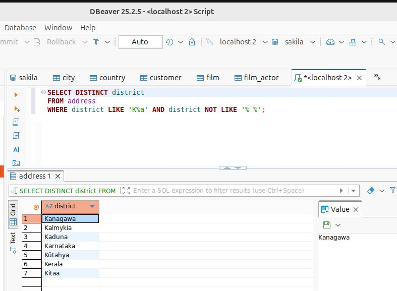
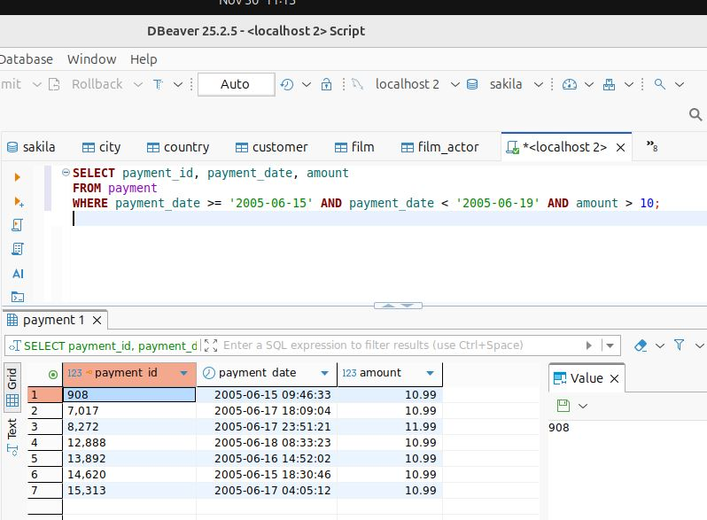
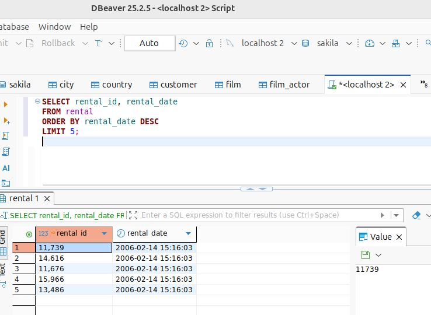
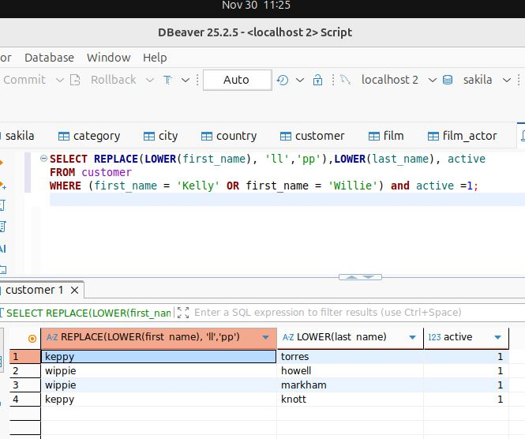
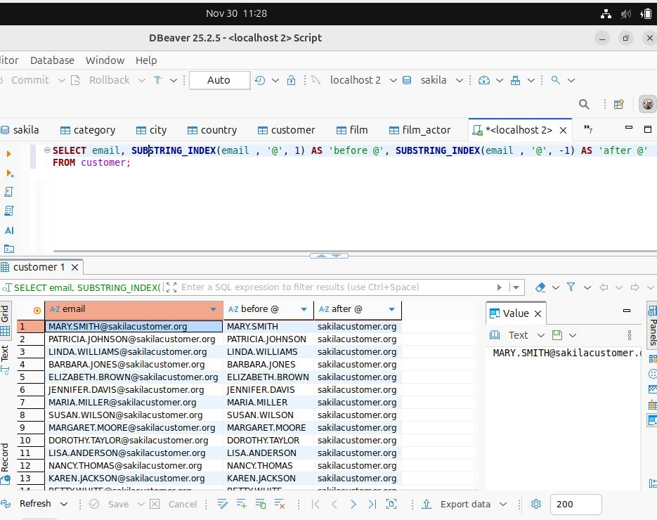
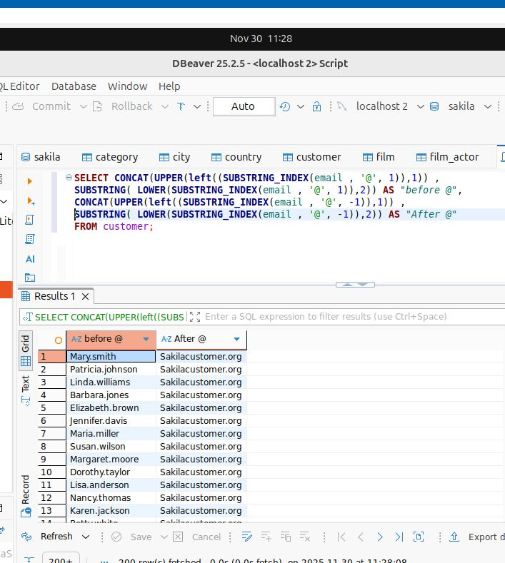

# Домашнее задание к занятию «SQL. Часть 1» - Пищук Н.В.

Инструкция по выполнению домашнего задания
Создайте форк репозитория с шаблоном решения на Github и переименуйте его в соответствии с названием или номером занятия, например, https://github.com/имя-вашего-репозитория/gitlab-hw или https://github.com/имя-вашего-репозитория/8-03-hw).
Выполните клонирование этого репозитория на свой компьютер с помощью команды git clone.
Выполните домашнее задание и заполните локально этот файл README.md:
вверху укажите название занятия и свои фамилию и имя;
в каждом задании добавьте решение в требуемом виде: текст/код/скриншоты/ссылка;
для корректного добавления скриншотов воспользуйтесь инструкцией «Как вставить скриншот в шаблон с решением»;
при оформлении используйте возможности языка разметки md. Кратко об этом можно прочитать в инструкции по MarkDown.
После завершения работы над домашним заданием сделайте коммит (git commit -m "comment") и отправьте его на Github (git push origin).
Для проверки домашнего задания преподавателем в личном кабинете прикрепите и отправьте ссылку на решение в виде md-файла в вашем Github.
Любые вопросы задавайте в разделе «Вопросы по заданию» в личном кабинете.
Желаем успехов в выполнении домашнего задания.

Задание можно выполнить как в любой IDE, так и в командной строке.

## Задание 1
Получите уникальные названия районов из таблицы с адресами, которые начинаются на «K», заканчиваются на «a» и не содержат пробелов.

## Решение

SELECT DISTINCT district
FROM address
WHERE district like 'K%a' and  district not like '% %';

## Задание 2
Получите из таблицы платежей за прокат фильмов информацию о платежах, которые были совершены в период с 15 по 18 июня 2005 года включительно и сумма которых превышает 10,00.

## Решение

SELECT payment_id, payment_date, amount 
FROM payment
WHERE payment_date >= '2005-06-15' AND payment_date < '2005-06-19' AND amount > 10;

## Задание 3
Получите последние пять фильмов в аренду.

## Решение

SELECT rental_id, rental_date  
FROM rental
ORDER BY rental_date DESC
LIMIT 5;

## Задание 4
Одним запросом получите информацию об активных покупателях по имени Келли или Уилли.

Сформируйте вывод следующим образом:

все буквы в фамилии и имени, написанные заглавными буквами, переведите в нижний регистр,
замените буквы 'll' в именах на 'pp'.
Дополнительные задания (со звёздочкой*)
Эти задания являются дополнительными, то есть не обязательными к выполнению, и никак не повлияют на получение вами зачёта по этому домашнему заданию. Вы можете выполнить их, если хотите глубже разобраться в материале.

## Решение

SELECT REPLACE(LOWER(first_name), 'll', 'pp'), LOWER(last_name), active
FROM customer
WHERE first_name IN ('Kelly', 'Willie') and active = 1;

## Задание 5*
Выведите адрес электронной почты каждого покупателя, разделив его на две части: в первой части должно быть указано значение до @, во второй — значение после @.

## Решение

SELECT email, SUBSTRING_INDEX(email , '@', 1) AS 'before @', SUBSTRING_INDEX(email , '@', -1) AS 'after @'
FROM customer;

## Задание 6*
Доработайте запрос из предыдущего задания, скорректировав значения в новых столбцах: первая буква должна быть заглавной, остальные — строчными.

## Решение

SELECT CONCAT(UPPER(left((SUBSTRING_INDEX(email , '@', 1)),1)) , SUBSTRING( LOWER(SUBSTRING_INDEX(email , '@', 1)),2)) AS "before @",
CONCAT(UPPER(left((SUBSTRING_INDEX(email , '@', -1)),1)) , SUBSTRING( LOWER(SUBSTRING_INDEX(email , '@', -1)),2)) AS "After @"
FROM customer;

